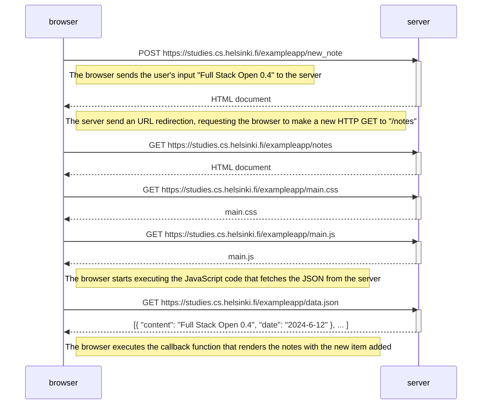

```mermaid
sequenceDiagram
    participant browser
    participant server

    browser->>server: POST https://studies.cs.helsinki.fi/exampleapp/new_note
    activate server

    Note right of browser: The browser sends the user's input "Full Stack Open 0.4" to the server

    server-->>browser: HTML document
    deactivate server

    Note right of browser: The server send an URL redirection, requesting the browser to make a new HTTP GET to "/notes"

    browser->>server: GET https://studies.cs.helsinki.fi/exampleapp/notes
    activate server
    server-->>browser: HTML document
    deactivate server

    browser->>server: GET https://studies.cs.helsinki.fi/exampleapp/main.css
    activate server
    server-->>browser: main.css
    deactivate server

    browser->>server: GET https://studies.cs.helsinki.fi/exampleapp/main.js
    activate server
    server-->>browser: main.js
    deactivate server

    Note right of browser: The browser starts executing the JavaScript code that fetches the JSON from the server

    browser->>server: GET https://studies.cs.helsinki.fi/exampleapp/data.json
    activate server
    server-->>browser: [{ "content": "Full Stack Open 0.4", "date": "2024-6-12" }, ... ]
    deactivate server

    Note right of browser: The browser executes the callback function that renders the notes with the new item added


```
