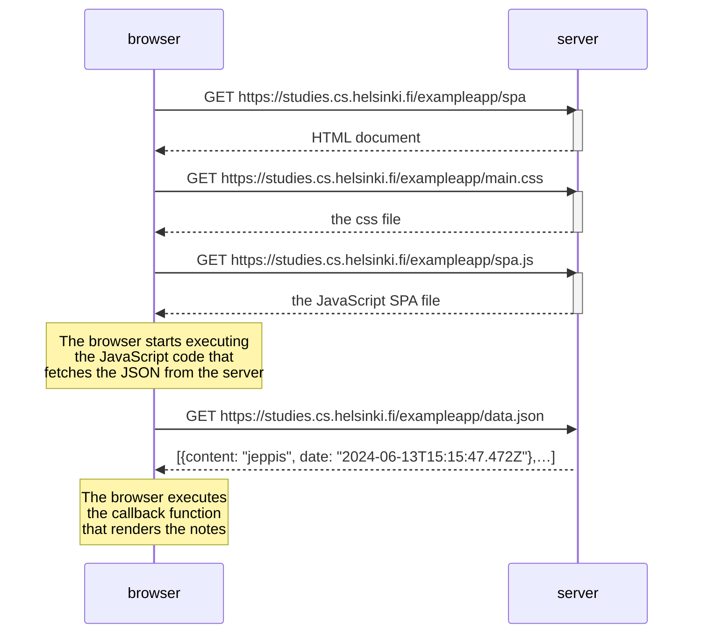

```mermaid
  sequenceDiagram
    participant browser
    participant server

    browser->>server: GET https://studies.cs.helsinki.fi/exampleapp/spa
    activate server
    server-->>browser: HTML document
    deactivate server

    browser->>server: GET https://studies.cs.helsinki.fi/exampleapp/main.css
    activate server
    server-->>browser: the css file
    deactivate server

    browser->>server: GET https://studies.cs.helsinki.fi/exampleapp/spa.js
    activate server
    server-->>browser: the JavaScript SPA file
    deactivate server

    note over browser: The browser starts executing <br/> the JavaScript code that <br/> fetches the JSON from the server

    browser->>server: GET https://studies.cs.helsinki.fi/exampleapp/data.json
    activate server
    server-->>browser: [{content: "jeppis", date: "2024-06-13T15:15:47.472Z"},…]

    note over browser: The browser executes <br/> the callback function <br/> that renders the notes


```
