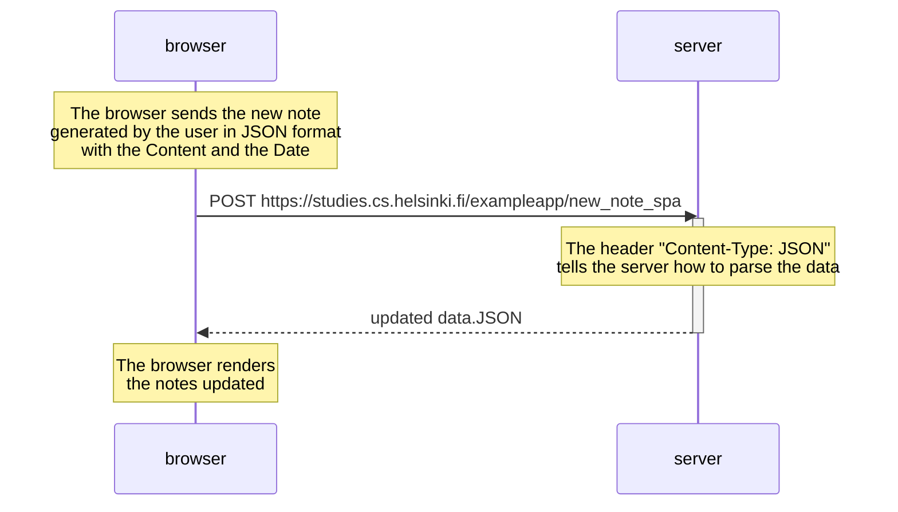

```mermaid
  sequenceDiagram
    participant browser
    participant server

    note over browser: The browser sends the new note <br/> generated by the user in JSON format <br/> with the Content and the Date

    browser->>server: POST https://studies.cs.helsinki.fi/exampleapp/new_note_spa
    activate server

    note over server: The header "Content-Type: JSON" <br/> tells the server how to parse the data

    server-->>browser: updated data.JSON
    deactivate server

    note over browser: The browser renders <br/> the notes updated


```
